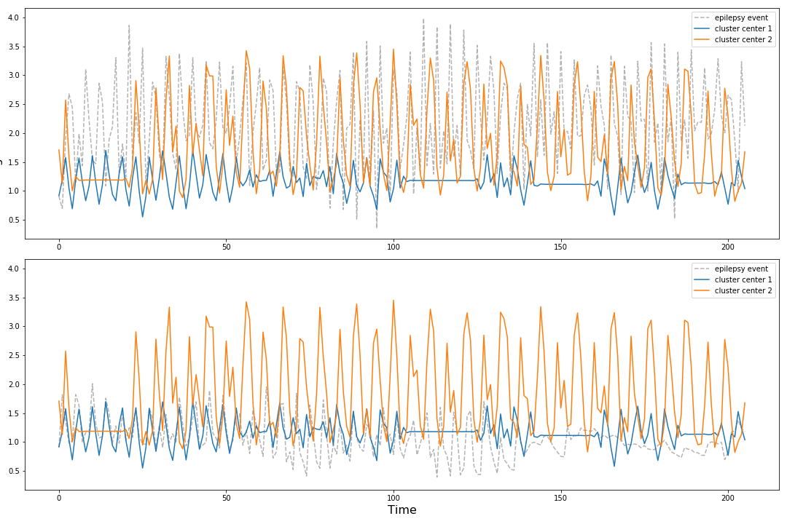

# **Identifing Seizures From Wrist Mounted Accelerometer data**

## Abstract
why seizure can be dangurouse and how having this on your smart watch may make people feel safer giving them a better life. plans is to explore the data by applying some unsupervised clustering to see if seizure data has a patteren that stands out and separate from daily tasks. the I will train a classificatino model to learn exacly what how to identify seizer activity so that is can be used in the implamentation yda yada. I plan on trying deep learning becasue neural networks have been proven to do well picking up on unpersevable patterens. I plan on making 4 different NN and comparing them to pick the best performing model. LSTM simple 1d cdd, wave net style 1 d cnn and doing a 2d fourier trasformation and using a 2d CNN.

## Data Source
The data for this project was generated with healthy participants simulating the class activities of performed. Data was collected from 6 participants using a tri-axial accelerometer on the dominant wrist whilst conducting 4 different activities including mimicking a seizure. The data can be found 
[here](http://www.timeseriesclassification.com/description.php?Dataset=Epilepsy). Each participant performed each activity 10 times at least. The mimicked seizures were trained and controlled, following a protocol defined by an medical expert. The sampling frequency was 16 Hz. Samples where truncated to the length of the shortest recording retained at about 30 seconds.

## Data Pre-Processing
I recieved the data in .arff format which I read in to my python environment with scipy.io.arff loadarff then converted to pandas for easier insepection and manipulation. Each row of the data was a sample of one physical activity. the signal was packed into list of  lists corisponding to the signal in the x, y and z directions. every sample was 206 time steps. There is also a column of the label for each activity.  
 
In the wild a this technology would be used in smart watches and I wanted to make sure that if a person were to ware there watch at a different angle on there wrist that the data still reflected the same acceleration. I compaired the data before and after 45% rotation aroung the z access. I observed that if the data was left in cartisien coordinants that that both x and y coordinants change when the acceleromter is rotated but if i converted the data to scherical coordiance, then oonly one of the coordinants changed. In hopes of keeping the most information from the data but still taking into consideration rotation of the accelrometer I converted the whole data set to scherical coordinance and did not use the theta coordinance moving forward.    

 

## **Looking for patterns with unsupervised learning**
My fisrt thought was that if the seizure activity was unique enough from the other activity it would be very handy to be able to cluster it out from other activities so this model could be used on different data with other unknow activities.  

## Time Series Clustering
To perform my clustering I wanted to pick a model that would utilize the time information and pattern as apposed to feature engineering that might take some domain spacific expertise. I utalised a model class from a Python package called tslearn that build on scikit-learn, numpy and scipy. For this clustering model I used the TimeSeriesKmeans clustering algorithm from th emodule tslear.clustering. FOr this model only one channel of accelrerometer dat could be used as input so I chose to use the rho coordinant in this model.

## Distance Metric Used in Model
To find the distance or similarity of time series samples I chose to use the inter model distance metric  Dynamic Time Warping. DTW deals with time shifts in such a way that alow th emodel to compair signal patterens even if the time or phase is shifted. Also, cluster centers are computed as the barycenters with respect to DTW, hence they allow to retrieve a sensible average shape whatever the temporal shifts in the cluster. 
 

## Determining how many different activities the model can pick out of the data.
Below is a plot of 9 models with k hyperparameter ranging from 1 to 9. 

This plot shows that the optimal number of clusters is 2,3 or 4. I will now make silhouette plots to compare the kmeans clustering model with 2 to 4 clusters. The silhouette value is a measure of how similar an object is to its own cluster (cohesion) compared to other clusters (separation). 
## Evaluate the model a diferent choses for cluster number
 
 

The fisrt plot is of the model with a k assignment of 2. Since this model has the best cohesion and speratin of clusters, it may be picking up on a seizure cluster and a not seizure cluster.  Lets take a look at the ratio of cluster assignents on the true seizure data. 
>26.5% of seizure data in one cluster and 75.5% of seizure data assigned to the other cluster. This means that with the time series clustering aproach this model would miss over 25% of seizures in people. 
I would like to make this better so I did some further exploration.

## Normalizing signals 

On further exploration it looks like the seizure data can vary greatly in it aplitude. In the figure below the orange signal is one center from the 2 k clustering model above, the orange signal is the other cluster center. The gray signals are two seperate seizure events. 
 
My next step in making my model better is to normalise each sample such that the values are between 0,1.  My hope is to have the clustering model focus on the changes in apletude and pattern as aposed to the ampletude its self. 

 
Here is a new elbow plot for the normalized data set. 

 
This elbow in this plot is even more elusive then the previouse one on the un-normalized data set. this makes me think that this is not the right direction to go.  

This non elbow may be due to the fact that the amplitude is useful in differentiating the clusters.  

<!--This leads me to the idea of pivoting from a time series clustering model to  makeing a dataframe of extracted features from each time series . then clustering with not time series methods.  -->

<!--## Clustering extracted features
??-->

The clustering approach to identifying features May not be fiezable with this data set. A supurvised learning approach may have to be used in the field so next I will pivot to that. 

## **Classification with 1D CNN**
In order to preserve the pattern of the signal for the classification process I want to try a tehnique from Jiang and Yin (2015). They proposed to transform the 1D acceleration signal, into a (1 x time x channel) image like tensor. This way the data can be model wit a convelutional neural network wich are very good at picking up patterns. 

## Data preprocessing
Here, I use the rho and phi channels of my accelerometer data. I used numpy to reshape the data set into (n_samples x series_length x n_channels) shapped tensor which came out to be (137 x 206 x 2)

I performed a validation train test split at 25/75 ratio for fitting. 

## Architecture for 1D CNN 
I chose this becasue it is similar to leNet, A classic simple architecture with two convolution layers, max pooling, and drop out, and two dense layers. I also chose one nueron and sigmoid activation for the output layer because I wanted to make a model that would predict seizure or no seizer in a binary manner.  

## Metrics
I chose to use recall as my primary metric in evaluating my model becasue the classes are imbalenced and a False negative could be life threatening. It would be better for a family member to contact a person with a false alarm over the persons family to not be contacted at all during a seizure event.

## How The 1D CNN  Learned
This simple model did pretty decient with a recall score evening out at around 80. This would mean that 80 percent of seizures would be correctly identified. I would like to see if I can make this better. 

## CLassification with 2D CNN
I got the idea to treat samples like spectrograms from Jiang and Yin (2015) who converted there 1 demensional time series accelreometer data into 2 dementional descrete fourier transformations. To make my own 2d fourier transformations I will take the fast forier transformation at sliding windows of time for each sample to make a spectragram like the ones use in audio data analysis.   

For each channel of each time series sample I created a spectrogram. an example of a sample and its two channels in below.  
 

<!--A spectrogram is used in speech and music analysis becasue its a way to visualize the fourier transformation as time passes.-->

I converted all samples to spectrograms traforming my data frame to the shape  (n_samples, spec_height, spec_width, n_channels) in preporation to fit with a CNN. I used almost the exact same architecture for the last 1D CNN with some changes for 2D convolution.

## How did it learned

Since the validation loss is goin up and up , instead of more training time I will make the architecture more complex (more trainable parameters) to see if it will help the model by extracting more feature out of the images.
 

## New Architecture
 

This deeper model did not do better interms of recall score. As far as loss, It did worse with the doubled amount of trainable parameters. After talking to an assosiet about audio analysis with spectrograms I have concluded that the reason why my spectrograms are doing so poorying maybe due to the fact that they are very small. I do not know that the sample rate or length of samples was used in the  Jiang and Yin (2015) paper. But, compair to music audio data that utilize spectrogram modeling, this accelerometer sampling rate is 3000 times lower leading to much less time windows to map to the spectrogram and very low resulotion images.

## **Long Short-term Memory Reacurant neural network (LTSM)**
LTSM are known for there ability to classify time series data. 

## LTSM1 Neural Network
I first try a very sime LTSM and train for 900 epochs 

The recalll was extremely unstable and stayed roughly around .2 after 75 epochs.  

Next I try increasing the amount of trainable peramters by increaseing the number of neurons per layer to see if this helps the network learn.
 
This increased the trainable parameters by an order of magnetude. 

TThis chnge does not seem to be doing the trick. Recall is still low and very irratic. 
 

Before changing direction with my model I first wanted to try making this LSTM NN deeper. Below is a the summary of a third LSTM that I added two dence layers and and added more neorons per layer then the first but less then the second for training time perposes.  
 

The Learning plots of this deeper LSTM network are below: 
 
This deeper model seems to have some peek recall scores higher then the other two LSTM but it is showing signs of over fitting. the validation and test scores are deviating.  

Lets add 50% drop out at the hidden layers out to the deep model to see if this helps wit over fitting. 
 
Adding drop out di prevent the the over fitting but after alot of time training the model is very iratic and the recall still pretty low.  

So car the simple 1D convolutional neural network ahas worked the bestso I am going to go back to something like that except adopt architecture idea from an arcitecture that was designed for time series.

## Simple WaveNet Architecture

WaveNet was developed by DeepMind researchers in 2016 for doing audio tasks such as text-to-speech. the thing that makes wavenet unique from a simple 1d CNN is the sequentialy doubling amounts of dilation with each layer. A dilated convolutionis a convolution where the filter is applied over an area larger than its length by skipping input values with a certain step. It is 
equivalent to a convolution with a **larger filter** derived from the 
original filter by dilating it with zeros, but is significantly **more 
efficient.** This is similar to pooling or strided  convolutions, but 
here the output has the same size as the input. As a special case, 
dilated convolution with dilation 1 yields the standard convolution.  By useing dilation the model gets a better global picture of each sample to capture more contextual information by looking a different segments of of the time series.  There is also the benifit of faster run time.

Original WaveNet was made to predict a series but I chose an output layer on one neuron and a sigmoid activation function to squiz the information into a binary prediction. It also was very very deep with patters of doubling dilation. I started small with one pattered of doubling dilarion. architecture summary is below.  

Judging by the learning curve this model is our best so far. 
 

This model does not show signs of over fitting. The recall is high and stable over epochs and the fitting time was very fast. I will save this model and move forward with evaluating with the hold out data that the model has never seen. 

## Evaluating simpleWave 1D CNN on Holdout Data

Utalizing the built in threshod of model.predict() the confusion matrix for simpleWave is as follows. 
 
This confusin matrix looks pretty good but what im interested in it the fasle positives and the false nagatives. The threshold needs to be tuned such that the false negative are minimized with out in turn causing too many false positives. It is very important that the model identifies the true seizure events but if a user of the product keeps getting bugged by false positives they may turn the device off.  

To find this balance I will have the waveNet model return the probability of each sample being positive, then compute the the f1 score of the predictions at each threshold. I am using the f1 score to assised in finding a ballnce of percision and recall. 

To see if this threshold will give us the ratio of false positive to false negativ we want I made a new confusion matrics with the threshold of .04.  

 

With this model and this threshold the false negative are the smalles probability and the false positives are are still pretty low. I believe this is a very good model for our needs.

# Conclusion
 - By attempting to cluster the data, it revieled that seizure data may not be unique enough for a simple time series cluster model to identify. If clustering wants to be persued , the data can be featurized andd other techniques may be more useful
 - Out of all the deep learing models tried on this data set, 1D convolutional neural network with double dilation amounts worked the best. 
 - Moving forward I believe it would benificial to try and use this dame model with data that contains other human activities
