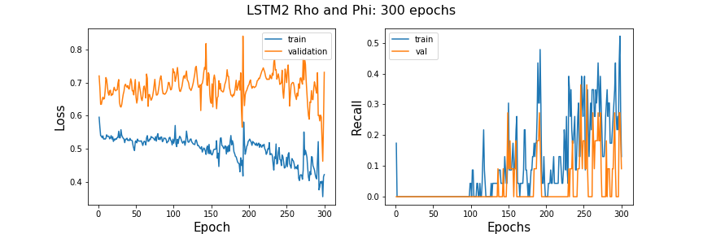
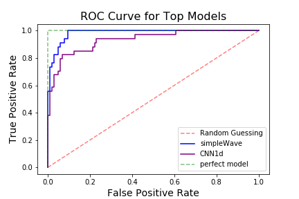

# **Identifying Seizures From Wrist Mounted Accelerometer Data**
 
 
## Abstract
Not knowing when your next seizure will be is a source of anxiety for people with epilepsy and their loved ones. Seizures can be dangerous and frightening if you are alone and not in a safe place. Knowing that a device like your smartwatch is there to call a family member, and the paramedics if needed, may ease some stress of daily life and increase the wellbeing of those with epilepsy. I have acquired some wrist-mounted accelerometer data from people doing activities including mimicking seizures. My plan is to explore the data by useing unsupervised clustering to see if seizure activity has a pattern that is unique from daily tasks. Then I will build and train a classification model to learn exactly how to identify seizer activity which then could be the model behind a smartwatch health alert app. I plan on utilizing deep learning because neural networks have been proven to do well in picking up on imperceptible patterns. I plan on making four different neural network models and comparing them to pick the best performing model. The models I will build are an LSTM, a simple 1d CNN, a NaveNet style 1d CNN and a 2D CNN with Fourier transformed signals.

## Data Source
The data for this project was generated with healthy participants simulating the class activities. Data were collected from 6 participants using a tri-axial accelerometer on the dominant wrist whilst conducting 4 different activities including mimicking a seizure. The data can be found
[here](http://www.timeseriesclassification.com/description.php?Dataset=Epilepsy). Each participant performed each activity 10 times at least. The mimicked seizures were trained and controlled, following a protocol defined by a medical expert. The sampling frequency was 16 Hz. Samples were truncated to the length of the shortest recording retained at about 30 seconds. Each recording is of one activity only.

## Data Pre-Processing
I received the data in .arff format which I read into a python environment with scipy.io.arff loadarff then converted to a pandas dataframe for easier inspection and manipulation. Each row of the data was a sample of one physical activity. The signal was packed into a nested list with the inner lists corisponding to the signal in the x, y, and z directions. Every sample was 206 time steps. There is also a column of the labels for each activity.  Below is an image of the raw data read into a pandas data frame. 
 
In the wild, this technology would be used in smartwatches and I want to make sure that if a person were to wear their watch at a different angle on their wrist that the data still reflected the same acceleration. Below, I compare the data before and after 45&deg; rotation around the z access.
   

 
 I observe that if the data was left in cartesian coordinates that both x and y change when the accelerometer is rotated, but if I convert the data to spherical coordinates, then only one of the coordinates changes. In hopes of keeping the most information from the data but minimizing differences when the accelerometer is rotated, I am  converting the whole data set to spherical coordinance and only using rho and phi directions moving forward.

## **Looking for patterns with unsupervised learning.**
 
## Time Series Clustering
To perform clustering on the data, I want to pick a model that will utilize the time information and pattern of the signal as opposed to feature engineering. Feature engineering might take some domain-specific expertise and I want to leave the data less tampered with if possible. I will utilize a Python package called tslearn that builds on Scikit-learn, NumPy, and Scipy. For this clustering model, I will use the TimeSeriesKmeans clustering algorithm from the module tslear.clustering. Only one channel of accelerometer data could be used as input to TimeSerieKMeans, so I chose to use the rho coordinate.
 
## Distance Metric Used in Model
To find the distance, or similarity of time series samples, I am choosing to use the inter-model distance metric called Dynamic Time Warping. DTW deals with time shifts in such a way that alow the model to compare signal patterns even if the time or phase is shifted between samples. Also, cluster centers are computed as the barycenters with respect to DTW, hence they allow the model to retrieve a sensible average shape whatever the temporal shifts in the cluster may be. Below are a couple of images to help clarify what DTW does. 

The top plot is an example of time series clustering with Euclidean distance chosen as the distance metric.
 
The bottom plot is an example of time series clustering this DTW. As you can see the cluster centers (red) represent the shape of the samples in the cluster.

## Determining how many different activities the model can differentiate in the data.
Below is a plot of 9 models with k hyperparameter ranging from 1 to 9. 

 
This plot shows that the optimal number of clusters is 2,3 or 4. I will now make silhouette plots to compare the kmeans clustering model with 2 to 4 clusters. The silhouette value is a measure of how similar an object is to its own cluster (cohesion) compared to other clusters (separation). 
## Evaluate the model a diferent choses for cluster number
 
 

The first plot is of the model with a k assignment of 2. Since this model has the best cohesion and separation of clusters, it may be picking up on a seizure cluster and a not seizure cluster.  Let’s take a look at the ratio of cluster assignments from the true seizure labels. 
>26.5% of seizure data in one cluster and 75.5% of seizure data assigned to the other cluster.  
This means that with the time series clustering approach this model would miss over 25% of seizures in people.

 
Next, I will see if normalizing the signals improves performance.

## Normalizing signals
 
On further exploration, it looks like the seizure data can vary greatly from sample to sample in amplitude. In the figure below the orange signal is one cluster center from the 2 k clustering model above, the blue signal is the other cluster center. The gray signals are two separate seizure events. 
 
To normalize the data I multiply every data point by the largest value in the signal such that the amplitude range is 0 to 1 for all samples. 
 
 
Here is a new elbow plot for the normalized data set. 
 
 
This elbow in this plot is even more elusive then the previous one on the un-normalized data set. This leads me to believe that this is not the right direction to go.  
 
This non-elbow may be due to the fact that the amplitude is useful in differentiating the clusters.  
 
From the above inspection with unsupervised learning, it appears that there is some uniqueness between the acceleration of daily activitie and seizure activity that can be picked up on from just clustering. Next, I will use the labels supplied with the data set to train a model to pick out seizure activity from everyday life more accurately. 

# **Classification**

## Scoring Metric
I am choosing to use recall as my primary metric in evaluating the models because the classes are imbalanced with the positive being the minority. Recall is the percentage of correctly labeled positive to all truly positive samples. With unbalanced classes, a metric like accuracy may cause the model to only predict negative due to the fact the majority of labels are negative. 
 
## **Classification with 1D CNN**
In order to preserve the pattern of the signal for the classification process, I will try a technique of transform 1D acceleration signal, into a (1 x time x channel) image-like tensor. This way the data can be modeled with a convolutional neural network. The motivation is because CNNs are very good at picking up patterns.
 
## Data Preprocessing
Here, I use the rho and phi channels of my accelerometer data. I am using numpy to reshape the data set into a (n_samples x series_length x n_channels) shaped tensor which came out to be (137 x 206 x 2).
 
I create a validation train test split at a 25/75 ratio for fitting.
 
## Architecture for 1D CNN
I am choosing this architecture because it is similar to LeNet, a classic simple architecture with two convolution layers, max pooling, and drop out, and two dense layers after convolution. I also am choosing one neuron and sigmoid activation for the output layer because I want to make a model that would predict seizure or no seizer in a binary manner. 

## How The 1D CNN  Learned
This simple model does pretty well with a recall score evening out at around 80%. This would mean that 80 percent of seizures would be correctly identified.  
 

 
## Classification With 2D CNN
I got the idea to treat samples like spectrograms from Jiang and Yin (2015) who converted there one-dimensional time series accelerometer data into two dimensional discrete Fourier transformations. To make my own 2d Fourier transformations I will take the fast Fourier transformation at sliding windows of time for each sample to make a spectrogram like the ones used in audio data analysis.   
 
 
An example of a transformed sample and its two channels is below.  
 
 
 
I am converting all samples to spectrograms transforming my data frame to the shape  (n_samples, spec_height, spec_width, n_channels) in preparation to fit with a CNN. I am using almost the exact same architecture for the last 1D CNN with some changes for 2D convolution.

## How did it learn?

Since the validation loss is going up and up, instead of more training time I will make the architecture more complex (more trainable parameters) to see if it will help the model by extracting more features out of the images.
 
 
## New Architecture
 

 
This deeper model is not doing better in terms of recall scores. As far as loss, It does worse with the doubled amount of trainable parameters. After talking to an associate about audio analysis with spectrograms I have concluded that the reason why my spectrograms are doing so pooling may be due to the fact that they are very small. I do not know that the sample rate or length of samples used in the  Jiang and Yin (2015) paper. But, compared to music signals that utilize spectrogram modeling, this accelerometer sampling rate is 3000 times lower leading to much fewer time windows to map to the spectrogram and very low-resolution images.

## **Long Short-term Memory Recurrent Neural Network (LTSM)**
I am choosing to try the classification with an  LSTMs RNN because they are known for there ability to classify time series data.

## LTSM1 Neural Network
I first try a very simple LSTM and train for 900 epochs 

 
The recall is extremely unstable and is staying roughly around 2% after 75 epochs.  

 
Next, I try increasing the number of trainable parameters by increasing the number of neurons per layer to see if this helps the network learn.
 
This increased the trainable parameters by an order of magnitude. 
 
This change does not seem to be doing the trick. The recall is still low and very erratic. 
 
 
I will now make the LSTM deeper in hopes of improving this model before moving on to the next classification model. Below is a summary of the third LSTM. I am adding two more LSTM layers and added more neurons per layer but less than the second model for training time purposes. Below is an image of the architecture summary and plots of learning rate. 
 
 
 
This deeper model seems to have some peek recall scores higher than the other two LSTM but it is showing signs of overfitting. The validation and test scores are deviating.  
 
Below is a learning rate plot after adding 50% drop out on the hidden layers to see if this helps with overfitting. I also fit for many more epochs to see if the recall and loss stabilize. 
 
Adding drop out did prevent the overfitting but after a lot of time training the model is still very erratic and the recall still low compared to the simple 1D CNN model.  

## Simple WaveNet Architecture
 
WaveNet was developed by DeepMind researchers in 2016 for doing audio tasks such as text-to-speech. The thing that makes WaveNet unique from a simple 1d CNN is the sequentially doubling amounts of dilation with each layer. A dilated convolution is a convolution where the filter is applied over an area larger than its length by skipping input values. It is
equivalent to a convolution with a **larger filter** derived from the
original filter by dilating it with zeros but is significantly **more
efficient.** This is similar to pooling or striding convolutions, but
here the output has the same size as the input. As a special case,
dilated convolution with dilation 1 yields the standard convolution. By using dilation the model gets a better global picture of each sample to capture more contextual information by looking at different segments of the time series.  There is also the benefit of faster run time. Below is a visualizatin of 1D dilation: 

 
Original WaveNet was made to predict a series but I am creating an output layer of one neuron and a sigmoid activation function to squeeze the output information into a binary prediction. Original WaveNet was very very deep with patters of doubling dilation. I am starting small with one sequence of doubling dilation. The architecture summary and learning plot are below.  
 

 
 
 
This model does not show signs of overfitting. The recall is high and stable over epochs and the fitting time was very fast.  

## **Comparing Classification Models**
The two best models, judging by the learning curves, are the simple 1D CNN and the 1D CNN with WaveNet style dilation. I will be referring to the dilated CNN as simpleWave. Below I will be comparing these two models to find the best for the specific application. 
 
As a general comparison, below is a ROC curve of the two models.  
 
The simpleWave model has better general performance than the 1D CNN but since there is a large cost disparity between false negatives and false positive I will examine the models with different positive prediction thresholds to optimize them for this cost difference.

## Finding the Appropriate Thresholds
It is very important that the model identifies the true seizure events for obvious reasons but if a user of the product keeps getting bugged by false positives they may turn the device off. To find this balance of outcomes I will find a threshold that will produce the most benefit in the application of the model.  
 
Below is a profit curve that takes into consideration the cost of each outcome of the model. I estimated the cost structure below but I have a function in the source code for this project that can take in input values for the cost of each outcome of the models and make predictions based on those costs. 
- cost of a false positive :  -5
- cost of a true positive :   100 - 5 = 95
 

 
The optimal model would depend on the cost one assigns to the outcomes and may take someone with industry knowledge or personal experience with epilepsy, to decide on those costs. That being said, with the costs I chose above, the models have about the same benefit with their respective thresholds.  
 
Below are side by side confusion matrices made with the best thresholds for profit. 
 
 
 
# Conclusion
- By attempting to cluster the data, it revealed that seizure activity mostly had a different pattern than other activities but may not be unique enough for a simple time-series cluster model to identify accurately. If clustering is to be pursued, the data can be featured and other techniques may be more useful.
 - Out of all the deep learning classification models tried on this data set, simpleWave 1D convolutional neural network with double dilation amounts worked the best. Although, depending on the cost of each outcome, a plain 1D CNN may work better.
- Moving forward I believe it would be beneficial to try and use these same models with data that contains other human activities so as to mimic the real world more closely.

