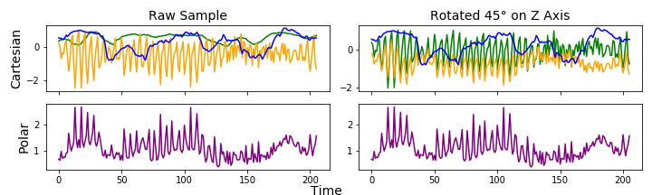

# **Identifing Seizures From Wrist Mounted Sensors**

> - data can be found here: http://www.timeseriesclassification.com/description.php?Dataset=Epilepsy 
>- The data was generated with healthy participants simulating the class activities of performed. Data was collected from 6 participants using a tri-axial accelerometer on the dominant wrist whilst conducting 4 different activities: walking, running, sawing, and mimicing seizure. 

## MVP:
create model to cluster accelerometr data into the k movement groups. 

## Other things:
Use a neural network to classify seizure not seizure movements.

## Data Pre-Processing
why did i choose to convert to poLAR AND CHOOSE rho. yada yada.

 

## Model and metrics
kmeans time eries . say a biv about this

**distance metric** 
say why DTW

**determining how many clusters are in data set** 

This plot shows me that the optimal number of clusters is 2,3 or 4. I will now make silhouette plots to compare kmeans clustering with 2 to 4 clusters. 

The best silhouette plot looks like the kmeans model with k=2. I know that there are more then 2 actions being performed so maybe seizure activity is so different that the model is picking up on a seizure, or not seizure clusters. Lets take a look at the ratio of cluster assignents on the true seizure data. 
>26.5% of seizure data in one cluster and 75.5% of seizure data assigned to the other cluster. 
this kmeans clustering m odel is not great. 

on further exploration it looks like the seizure data can vary greatly in it aplitude. 
 
My next step in making my model better is to normalise each sample such that the values are between 0,1 but the pateres is the same 

Here is a new elbow plot for the normalized data set 
 
this elbow is more elusive then the previouse one on the un normalized data set. this makes me think that this is not the right direction to go.  

this may be due to the fact that the amplitude variation with time is useful in differentiating the clusters.  

This leads me to the idea of pivoting from a time series clustering model to  makeing a dataframe of extracted features from each time series . then clustering with not time series methods. 
