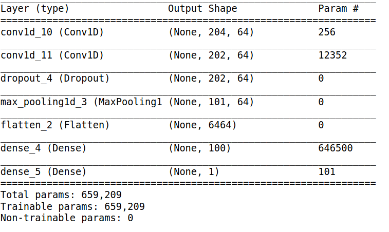

# **Identifing Seizures From Wrist Mounted Accelerometer data**

The data for this project was generated with healthy participants simulating the class activities of performed. Data was collected from 6 participants using a tri-axial accelerometer on the dominant wrist whilst conducting 4 different activities including mimicking a seizure. The dat acan be found 
[here](http://www.timeseriesclassification.com/description.php?Dataset=Epilepsy). Each participant performed each activity 10 times at least. The mimicked seizures were trained and controlled, following a protocol defined by an medical expert. The sampling frequency was 16 Hz. Samples where truncated to the length of the shortest recording retained at about 30 seconds.

## **Data Pre-Processing**
why did i choose to convert to poLAR AND CHOOSE rho. yada yada.

 
maybe add how theta a phi change with rotation too.

## **Why unsupervised as a fisrt model**
something about finding patterens in the real world . if seizure activity is so different we should be able to cluster it out with out the need for labels.

## Unsupervised Model 
kmeans time eries and the tslearn library . say a bit about this

## distance metric
say what DTW is and why I use it

## determining how many clusters the model can differenciate

This plot shows me that the optimal number of clusters is 2,3 or 4. I will now make silhouette plots to compare kmeans clustering with 2 to 4 clusters. 
## Evaluate the model a diferent choses for cluster number

The best silhouette plot looks like the kmeans model with k=2. I know that there are more then 2 actions being performed so maybe seizure activity is so different that the model is picking up on a seizure, or not seizure clusters. Lets take a look at the ratio of cluster assignents on the true seizure data. 
>26.5% of seizure data in one cluster and 75.5% of seizure data assigned to the other cluster. This means that with the time series clustering aproach this model would miss over 25% of seizures in people(patients? victums?). 

## More eploration

On further exploration it looks like the seizure data can vary greatly in it aplitude. In the figure below the orange signal is one center, the orange signal is the pther and the gray signals are two seperate seizure events. 
 
My next step in making my model better is to normalise each sample such that the values are between 0,1.  My hope is to have the clustering model focus on the patteren as aposed to the ampletude. 

## Same aproach but with normalized samples

Here is a new elbow plot for the normalized data set 
 
this elbow is more elusive then the previouse one on the un normalized data set. this makes me think that this is not the right direction to go.  

this may be due to the fact that the amplitude variation with time is useful in differentiating the clusters.  

This leads me to the idea of pivoting from a time series clustering model to  makeing a dataframe of extracted features from each time series . then clustering with not time series methods. 

## Clustering extracted features
??

## **Classification with CNN**
Jiang and Yin (2015) proposed to transform the 1D acceleration
signal into a 2D image-like signal so that CNN can be applied to do the feature extraction and
classification

## DAta preprocessing
no normalization but same convertion to rho to avoid the problems assosiated with a writ watch shifting

convering to the correst chape for a CNN

train test split at 25%

## Architecture
summary
why i chose what 

## Metrics
why i chose recall

## How it learned

## Another architecture tweeking?

## Results 
confusion matrix

## moving forward
